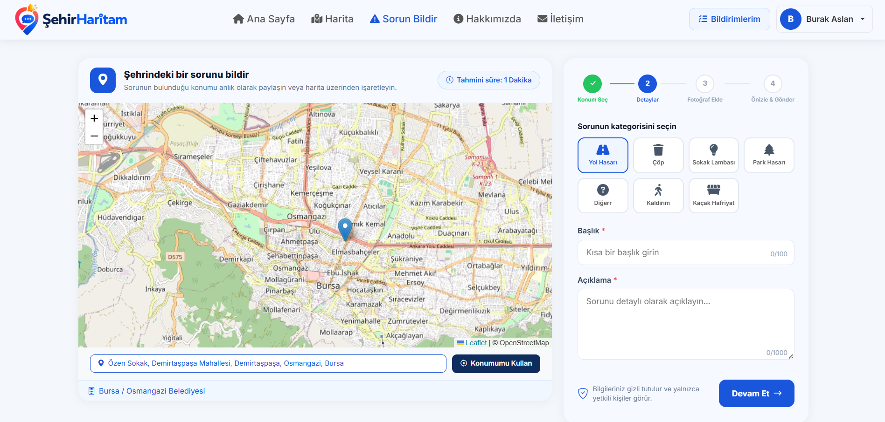
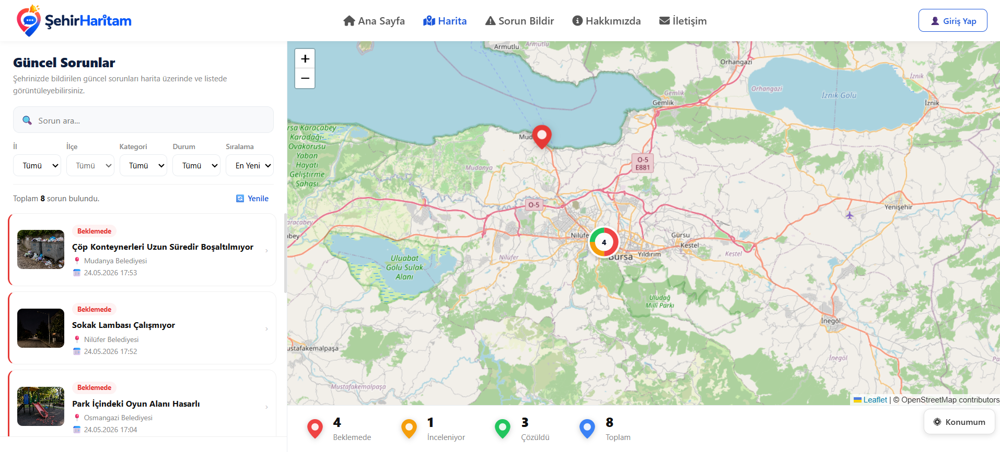
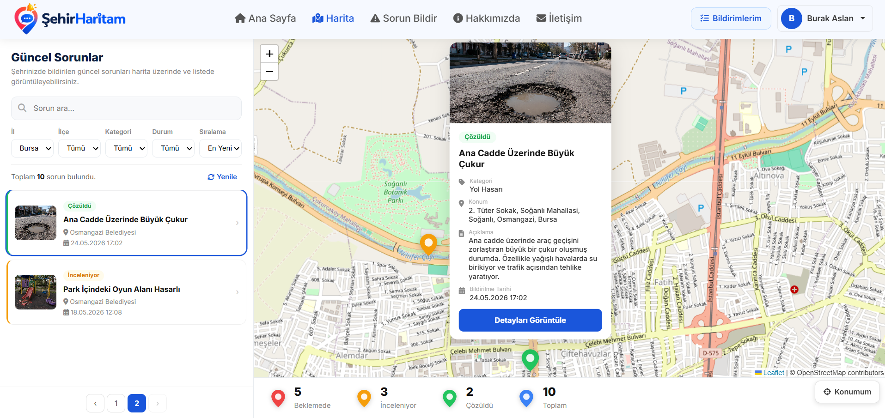
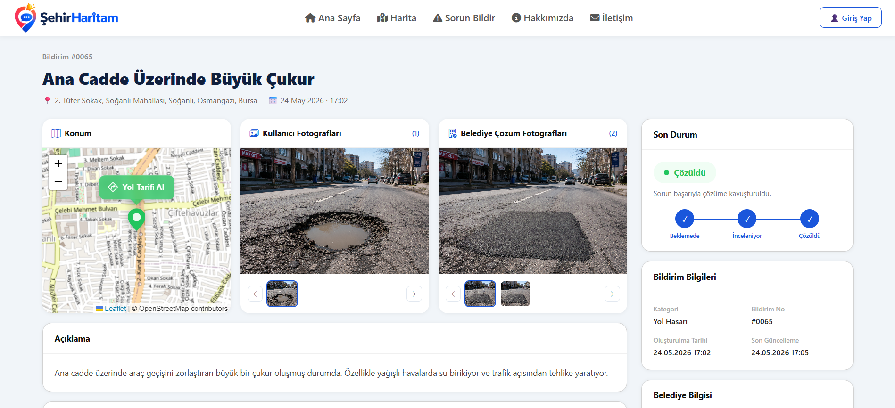
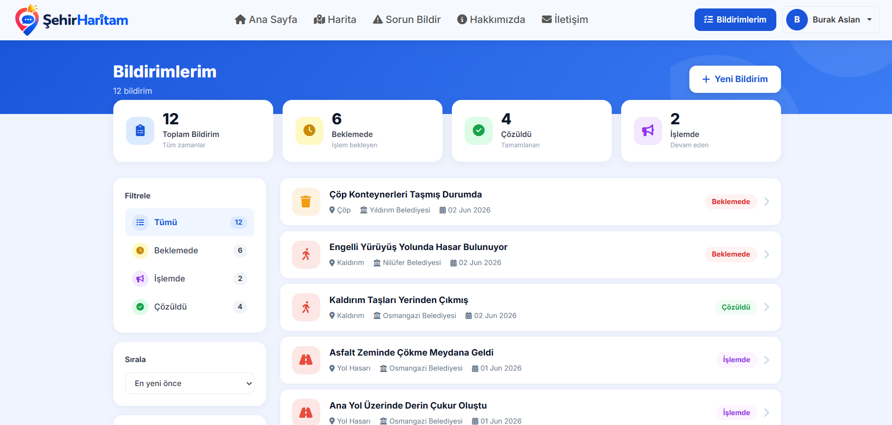
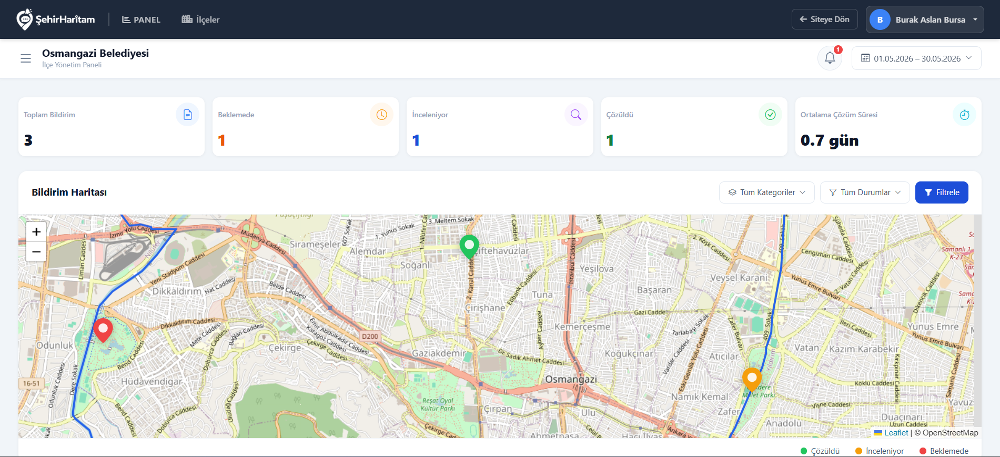
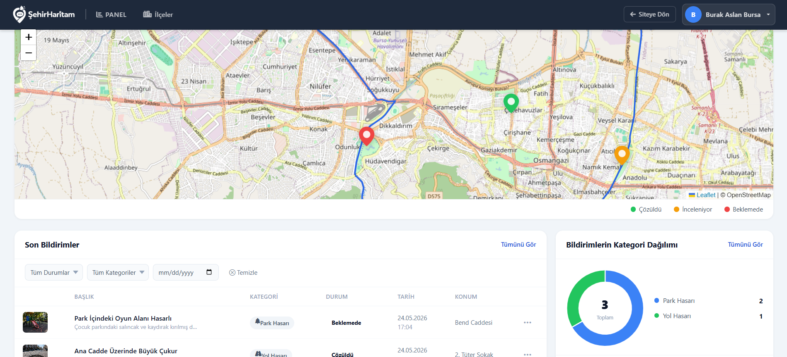
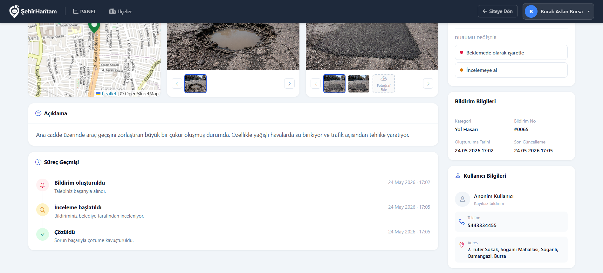

# 🗺️ SehirHaritam — Akıllı Şehir Sorun Raporlama Platformu
### Smart City Issue Reporting Platform

<p align="center">
  
  
  
  
  
  
</p>

---

## 🇹🇷 Türkçe

### 📌 Proje Hakkında

**SehirHaritam**, vatandaşların şehirdeki altyapı sorunlarını (bozuk yol, arızalı sokak lambası, çöp, park hasarı vb.) harita üzerinden kolayca raporlayabildiği bir akıllı şehir web platformudur.

> 📍 **Tek tıkla anlık konum al** — Tarayıcı üzerinden kullanıcının gerçek zamanlı konumunu alarak haritada otomatik olarak işaretler. Manuel seçim de desteklenir.
>
> 📸 **Görsel kanıt yükle** — Vatandaş sorunu fotoğraflayıp bildirimine ekleyebilir. Belediye de çözüm sonrası fotoğraf yükleyerek süreci belgeler.

Belediye yöneticileri tüm bildirimleri yönetici paneli üzerinden takip edebilir, durumlarını güncelleyebilir ve ilçe bazlı istatistikleri anlık olarak görüntüleyebilir.


---
## 📬 Kaynak Kod Talebi
 
*Bu projenin kaynak kodları gizlidir.* Kod incelemek, referans almak veya iş birliği teklifi için LinkedIn veya e-posta üzerinden benimle iletişime geçebilirsiniz.

---


### ✨ Özellikler

| Özellik | Açıklama |
|---|---|
| 📍 Harita Tabanlı Bildirim | Leaflet.js + OpenStreetMap ile interaktif harita üzerinden konum seçimi |
| 📸 Fotoğraf Yükleme | Vatandaş sorun fotoğrafı, belediye çözüm fotoğrafı yükleme |
| 🔄 Adım Adım Bildirim Formu | Konum Seç → Detaylar → Fotoğraf Ekle → Önizle & Gönder |
| 🔐 Kullanıcı Girişi / JWT | Güvenli kimlik doğrulama sistemi |
| 🛠️ Yönetici Paneli | İstatistikler, bildirim listesi, durum yönetimi, kategori dağılımı |
| 📊 Süreç Takibi | Beklemede → İnceleniyor → Çözüldü akışı ve geçmiş kaydı |
| 🌍 Coğrafi Veri | PostgreSQL/PostGIS ile konumsal veri depolama ve sorgulama |

### 📸 Ekran Görüntüleri

**Ana Sayfa**
.

---

**Sorun Bildir — Adım Adım Form**


---

**Harita — Güncel Sorunlar**


---

**Harita — Sorun Detay Popup**


---

**Sorun Detay Sayfası**


---

**Bildirimler Sayfası**


---

**Belediye Yönetici Paneli — Genel Bakış**


---

**Yönetici Paneli — Bildirim Listesi & Kategori Dağılımı**


---

**Yönetici Paneli — Bildirim Detay & Durum Yönetimi**


---

### 🏗️ Mimari

Proje **Clean Architecture** prensiplerine uygun olarak geliştirilmiştir. MVC ve API katmanları birbirinden ayrılmış olup HttpClient üzerinden haberleşmektedir.

```
📦 SehirHaritam
├── 🌐 SehirHaritam.API            → RESTful API katmanı (JWT, endpoint'ler)
├── 🖥️  SehirHaritam.MVC            → Kullanıcı arayüzü (Leaflet.js, Bootstrap 5)
├── 📊 SehirHaritam.Application    → İş mantığı (servisler, DTO'lar)
├── 🗄️  SehirHaritam.Domain         → Entity'ler, arayüzler
└── 💾 SehirHaritam.Infrastructure → EF Core, PostGIS, repository'ler
```

### 🛠️ Teknolojiler

- **Backend:** ASP.NET Core Web API, ASP.NET Core MVC (.NET 10)
- **ORM:** Entity Framework Core
- **Veritabanı:** PostgreSQL + PostGIS
- **Harita:** Leaflet.js, OpenStreetMap
- **Güvenlik:** JWT Authentication
- **Frontend:** HTML5, CSS3, Bootstrap 5
- **Mimari:** Clean Architecture, RESTful API

---

## 🇬🇧 English

### 📌 About the Project

**SehirHaritam** (City Map) is a smart city web platform that enables citizens to report urban infrastructure issues — such as damaged roads, broken street lights, waste problems, or park damage — directly on an interactive map.

> 📍 **One-click live location** — Instantly captures the user's real-time GPS location via the browser and pins it on the map automatically. Manual selection is also supported.
>
> 📸 **Photo evidence upload** — Citizens can attach photos of the issue to their report. Municipalities can upload resolution photos to document completed fixes.

Municipal administrators can track all reports, update statuses, and view real-time district-level statistics through a dedicated admin panel.

### ✨ Features

| Feature | Description |
|---|---|
| 📍 Map-Based Reporting | Interactive location selection via Leaflet.js + OpenStreetMap |
| 📸 Photo Upload | Citizens attach problem photos; admins upload solution photos |
| 🔄 Step-by-Step Form | Location → Details → Photo → Preview & Submit |
| 🔐 Auth / JWT | Secure user authentication with JSON Web Tokens |
| 🛠️ Admin Panel | Stats dashboard, report list, status management, category chart |
| 📊 Status Tracking | Pending → Under Review → Resolved workflow with full history |
| 🌍 Geospatial Data | Location data stored and queried with PostgreSQL/PostGIS |

### 🏗️ Architecture

Built following **Clean Architecture** principles. The MVC and API layers are fully separated and communicate via HttpClient.

```
📦 SehirHaritam
├── 🌐 SehirHaritam.API            → RESTful API layer (JWT, endpoints)
├── 🖥️  SehirHaritam.MVC            → User interface (Leaflet.js, Bootstrap 5)
├── 📊 SehirHaritam.Application    → Business logic (services, DTOs)
├── 🗄️  SehirHaritam.Domain         → Entities, interfaces
└── 💾 SehirHaritam.Infrastructure → EF Core, PostGIS, repositories
```

### 🛠️ Tech Stack

- **Backend:** ASP.NET Core Web API & MVC (.NET 10)
- **ORM:** Entity Framework Core
- **Database:** PostgreSQL + PostGIS
- **Mapping:** Leaflet.js, OpenStreetMap
- **Auth:** JWT
- **Frontend:** HTML5, CSS3, Bootstrap 5
- **Architecture:** Clean Architecture, RESTful API

---

## 👤 Developer / Geliştirici

**Burak Aslan** — Junior .NET Developer

<p>
  <a href="https://linkedin.com/in/burak-aslann">
    
  </a>
  <a href="mailto:burakaslan.dev@gmail.com">
    
  </a>
  <a href="https://github.com/aslanburak">
    
  </a>
</p>
